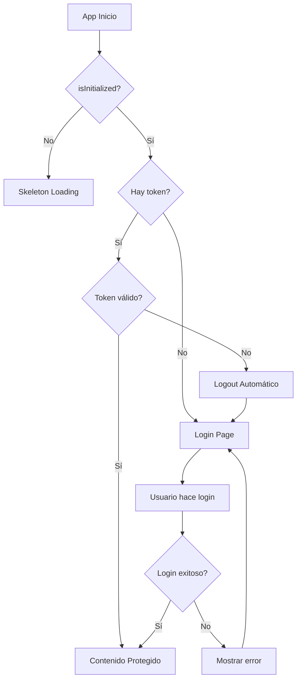

# Sistema de Autenticación Mejorado - SukaFront

## 🔐 Características Implementadas

### 1. **Verificación Automática de Token**
- **AuthContext** ahora verifica automáticamente la validez del token al cargar la aplicación
- Función `checkAuth()` que valida el token con el backend
- Estado `isInitialized` para controlar el estado de carga inicial

### 2. **Gestión de Tokens Expirados**
- **Interceptor de Axios** mejorado con refresh automático de tokens
- Callback `onTokenExpired` para logout automático cuando falla el refresh
- Limpieza automática del token cuando expira

### 3. **Redirecciones Inteligentes**

#### **ProtectedRoute** (Rutas Protegidas)
```typescript
- Si no está inicializado → Muestra skeleton
- Si no hay token → Redirige a /login
- Si hay token válido → Renderiza contenido protegido
```

#### **PublicRoute** (Rutas Públicas - NUEVO)
```typescript
- Si no está inicializado → Muestra skeleton
- Si ya está autenticado → Redirige a /
- Si no está autenticado → Renderiza login
```

### 4. **Flujo de Autenticación Completo**

#### **Escenario 1: Usuario No Autenticado**
1. Accede a cualquier ruta protegida (`/`, `/pokedex/pikachu`)
2. `ProtectedRoute` detecta falta de token
3. Redirige automáticamente a `/login`
4. Usuario completa login
5. Redirige a la ruta raíz `/`

#### **Escenario 2: Usuario Ya Autenticado**
1. Accede directamente a `/login`
2. `PublicRoute` detecta token existente
3. Redirige automáticamente a `/`

#### **Escenario 3: Token Expirado**
1. Usuario navega con token expirado
2. Axios interceptor detecta 401
3. Intenta refresh automático
4. Si falla → Logout automático → Redirige a `/login`
5. Muestra mensaje "Sesión expirada"

### 5. **Estados de Carga Mejorados**
- **Skeleton screens** durante inicialización
- Estados de loading consistentes en toda la aplicación
- UX fluida sin flashes de contenido

## 🔧 Componentes Modificados

### **AuthContext.tsx**
```typescript
interface AuthState {
  token: string | null
  loading: boolean
  error?: string
  isInitialized: boolean  // ← NUEVO
}

interface AuthContextType extends AuthState {
  checkAuth: () => Promise<boolean>  // ← NUEVO
}
```

### **axios.ts**
```typescript
// Callback para logout automático
export const setTokenExpiredCallback = (callback: () => void) => {
  onTokenExpired = callback
}
```

### **PublicRoute.tsx** (NUEVO)
```typescript
// Maneja rutas públicas como login
// Redirige a / si ya está autenticado
```

### **routes.tsx**
```typescript
// Estructura mejorada con PublicRoute
{
  element: <PublicRoute />,
  children: [{ path: '/login', element: <LoginPage /> }]
}
```

## 🎯 Beneficios Implementados

### ✅ **Seguridad**
- Verificación automática de tokens
- Logout automático en tokens expirados
- Refresh automático de tokens

### ✅ **UX Mejorada**
- Sin redirecciones innecesarias
- Estados de carga consistentes
- Mensajes de error claros

### ✅ **Robustez**
- Manejo de estados edge cases
- Recuperación automática de errores
- Persistencia de sesión

## 🧪 Casos de Prueba

### **Caso 1: Acceso Directo a Ruta Protegida**
```
URL: http://localhost:2770/
Sin token → Redirige a /login ✅
```

### **Caso 2: Login con Usuario Ya Autenticado**
```
URL: http://localhost:2770/login
Con token válido → Redirige a / ✅
```

### **Caso 3: Token Expirado**
```
Token expirado en memoria
Hace petición → 401 → Intenta refresh
Si refresh falla → Logout + Redirige a /login ✅
```

### **Caso 4: Login Exitoso**
```
Login correcto → Redirige a / ✅
Mantiene sesión activa ✅
```

## 🔄 Flujo de Estados



## 🏆 Resultado Final

El sistema de autenticación ahora es **completamente robusto** y maneja todos los escenarios de usuario de manera elegante:

- ✅ **Redirección automática al login** si no hay token
- ✅ **Redirección automática al inicio** si ya está autenticado
- ✅ **Manejo de tokens expirados** con logout automático
- ✅ **Estados de carga** consistentes y profesionales
- ✅ **UX fluida** sin flashes o redirecciones confusas

¡El sistema está listo para producción! 🚀